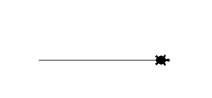
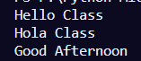
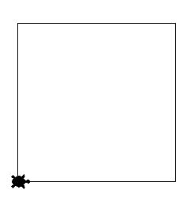

## Using The Turtle Library
To get started with turtle we need to make the library avaiable inside our python file. To do this we "import" the library. We then make the features of the library accessible by import everything (*) from the turtle library. 
Finally we create a new instance of turtle by assigning turtle to a variable t. Let's draw our first line
```Python
import turtle
from turtle import *
t = Turtle()
```
## Our First Line and Shapes
Let's use turtle to draw a line 200px long. 

```python
t.shape('turtle')

t.forward(200)
```
We used t.shape to have the line drawn by a turtle(We don't need to do this I just like it). Using the forward function and passing in an argument of 200 we can draw a line 200px long. 



Let's examine what a function is and how we just used a pre-made one by turtle. Functions are input/output machines that CAN (not always) accept an argument/paramter AKA an input, and output something. Let's create a unique function that accepts an input and outputs a message

```python
def message(input):
    print(input)
message("Hello Class")

```
Here we created a function using "def" called message that accepts an input. Inside the function we print the input in our terminal. Notice that the contents of the function must be indented inside the function. 

Finally we have to "call" the function and pass in the argument. Try running the function multiple times with different inputs and check the console



## Shapes in Turtle
Let's go back and create a function that uses turtle to create a square. Let's call the function "square" and let it accept an input of x. Inside we will have turtle move forward x, turn left 90 degrees, then move forward x again, repeating until we have a square. We should see the following



Hopefully you were able to do this solo but if not your code should look as it does below

```python
def square(x):
    t.forward(x)
    t.left(90)
    t.forward(x)
    t.left(90)
    t.forward(x)
    t.left(90)
    t.forward(x)
    t.left(90)
square(200)
```

Let's try  a triangle next. Let's try both an equilateral triangle and right triangle. The right triangle does not need an input, you can do it by manually assigning the values. Note that the first triangle is commented so it will not run.

```python

def equal(x):
    t.forward(x)
    t.left(120)
    t.forward(x)
    t.left(120)
    t.forward(x)
equal(200) 

def right():
    t.forward(100)
    t.left(90)
    t.forward(100)
    t.left(135)
    t.forward(142)
right()

```


1. Let's draw 1 rectangle witha width of 100px and a length of 125px.
2. Draw 1 Triangle with 3 equal sides, length 90px. 
   